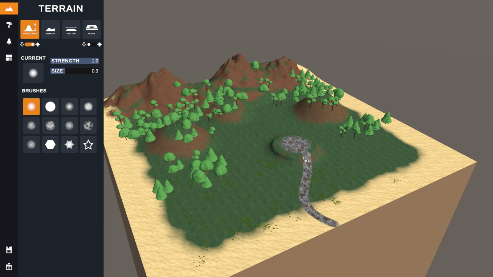
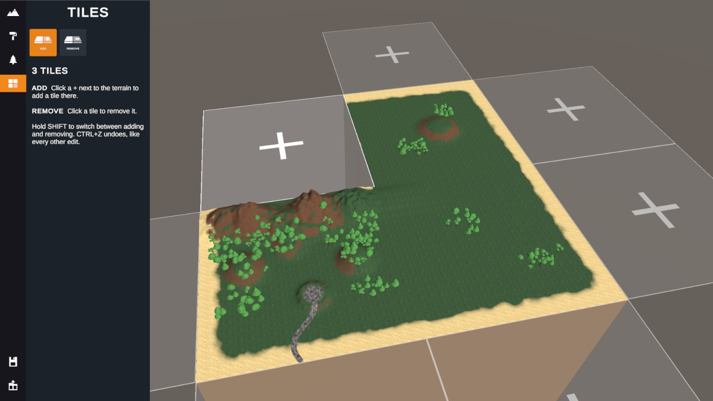
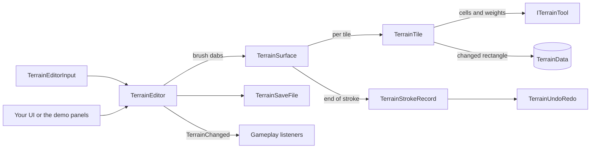

# Runtime Terrain Editor for Unity

A Unity 6 system that lets players sculpt, paint and plant terrain while the game is running. It covers one terrain
or a whole grid of terrain tiles, with undo/redo, save files and tiles that can be added while you play. Drop one
prefab into a scene and press Play.

**[Play the demo in your browser](https://dannytran-dev.github.io/UnityRuntimeTerrainEditor/)** (desktop browser
with WebGL 2).

[](https://dannytran-dev.github.io/UnityRuntimeTerrainEditor/)




## Features

- **Sculpting:** raise, lower, flatten and smooth, with 12 brush shapes (Unity's own terrain brushes), size,
  strength and rotation. A brush preview follows the ground under the pointer.
- **Texture painting:** paint any of the terrain's layers. Layers can be added, replaced or removed at runtime, and
  painted areas keep their texture.
- **Trees and grass:** scatter trees with a minimum spacing, paint grass density, and erase everything or one type.
- **Holes:** dig and fill holes for caves and tunnel entrances. The collider gets the holes too.
- **Several terrain tiles:** a grid of terrains is edited as one surface. Strokes cross tile borders and the seams stay
  closed. When a scene has no terrain, a grid of tiles is generated.
- **Grow the map while playing:** click a **+** next to the terrain to add a tile, or click a tile to remove it. New
  tiles match the others and blend into the ground next to them.
- **Undo/redo:** every stroke is one step, across all tiles and all kinds of edits, including adding and removing tiles.
- **Save and load:** compact binary save files with heights, textures, trees, grass, holes and the tile layout.
  Heightmaps can be imported from 16-bit RAW files or images and exported as RAW.
- **Rebindable controls:** an Input Action Asset with every control, working with mouse, pen and touch.
- **Extensible:** add your own brush operations by implementing one small interface, and react to edits through a
  `TerrainChanged` event (for example to rebuild a NavMesh).

## Try it

The quickest way is the [web demo](https://dannytran-dev.github.io/UnityRuntimeTerrainEditor/). In the browser, use the
Save and Load buttons in the panel, since F5 reloads the page.

To open it in Unity:

1. Clone the repository and open the folder with **Unity 6000.3** (made with 6000.3.22f1) from Unity Hub.
2. Open `Assets/RuntimeTerrainEditor/Demo/Scenes/RuntimeTerrainEditorDemo.unity` and press Play.

The panel on the left switches between the Terrain, Paint, Foliage and Tiles tools, and holds Save and Load.

| Action | Control |
|---|---|
| Edit | Left mouse / touch |
| Invert (lower, fill holes, erase trees and grass, remove tiles) | Hold Shift |
| Undo / Redo | Ctrl+Z / Ctrl+Y |
| Brush size / rotation | `[` `]` / `,` `.` (or Ctrl / Alt + scroll wheel) |
| Save / Load (demo) | F5 / F9 |
| Move camera | WASD, Q/E down/up, Left Shift for faster |
| Pan / look / zoom | Middle mouse / right mouse / scroll wheel |

Tiles placed in the editor work the same way: put terrains of the same size side by side (for example with Unity's
*Create Neighbor Terrains*) and the editor treats them as one surface.



## Use it in your project

1. Copy `Assets/RuntimeTerrainEditor` into a URP project with the **Input System** package. The `Demo` folder is
   optional; its UI also needs uGUI and TextMesh Pro.
2. Add a Terrain and a camera tagged `MainCamera` to a scene, or leave the terrain out and one is generated.
3. Drag `Prefabs/TerrainEditor.prefab` into the scene and press Play.

Control it from your own UI or gameplay code through `TerrainEditor.Instance`:

```csharp
TerrainEditor editor = TerrainEditor.Instance;
editor.SetDeformMode(DeformMode.Smooth);
editor.SetBrushSize(0.3f);
editor.SetBrushStrength(0.5f);
editor.Undo();

editor.AddTile(new Vector3(250f, 0f, 50f)); // extend the map with a tile in the free spot there

editor.SaveToFile(TerrainEditor.GetSavePath("MyMap"));

editor.TerrainChanged += change =>
{
    if (change.Includes(TerrainChannels.Heights))
        RebuildNavMesh(change.WorldBounds);
};
```

New brush operations plug into the same pipeline as the built-in ones:

```csharp
public sealed class TerraceTool : ITerrainTool
{
    public float StepHeight { get; set; } = 0.05f;
    public TerrainChannel Channel => TerrainChannel.Heights;

    public void Apply(in TerrainToolContext context)
    {
        RectInt cells = context.Footprint.Cells;
        for (int z = cells.yMin; z < cells.yMax; z++)
        {
            Span<float> heights = context.Heights.Row(z).Slice(cells.xMin, cells.width);
            ReadOnlySpan<float> weights = context.Footprint.Row(z);
            for (int i = 0; i < heights.Length; i++)
            {
                float terraced = Mathf.Round(heights[i] / StepHeight) * StepHeight;
                heights[i] = Mathf.Lerp(heights[i], terraced, context.Strength * weights[i]);
            }
        }
    }
}

editor.SetCustomTool(new TerraceTool()); // undo, seams, uploads and colliders are handled for you
```

The full guide covers every component, trees and grass, holes, tiles, save files and custom tools:
[Assets/RuntimeTerrainEditor/README.md](Assets/RuntimeTerrainEditor/README.md).

## Architecture



- **`TerrainEditor`** turns input into strokes, picks the tool for the current mode and owns the undo history, saving
  and tile management. It is the only class UI code needs.
- **`TerrainSurface`** treats all tiles as one piece of ground: it sends each brush dab to the tiles it touches, keeps
  the seams between them closed and gathers a stroke into one undo step.
- **`TerrainTile`** holds CPU copies of one terrain's data, runs tools on them and uploads only what changed.
- **Tools** (`ITerrainTool`) are small classes that only change values in a grid. Raise, flatten, smooth, paint, trees,
  grass and holes are all written this way.
- The reusable core in `Scripts` never references the `Demo` folder, so the demo UI can be deleted or replaced.

## How it works

- **Edits never touch your assets.** The editor works on a runtime copy of each TerrainData, and keeps CPU copies of
  the heights, texture weights, grass, trees and holes. Tools edit those copies, and each frame the changed rectangle
  is uploaded to the terrain once, however many dabs the frame had (only the grass types that changed). Colliders are
  refreshed every 0.1 s while sculpting (adjustable, or only when the stroke ends) and once when the stroke ends.
- **One pipeline for every tool.** A brush dab is a position, diameter, shape, rotation and strength in world space.
  `TerrainSurface` finds the tiles the dab touches, turns the brush shape into weights for the cells under it, and
  hands them to an `ITerrainTool`.
- **Strokes stay smooth at any speed.** Dabs are spaced along the pointer path between frames, and the frame's
  strength is split between them, so fast strokes leave no gaps.
- **Undo stores only what changed.** The first time a stroke touches a 32×32 block of heights, texture weights, grass
  or holes, that block is copied (into reused buffers). An undo step keeps one copy of those blocks, which undo and
  redo swap with the terrain, and only the trees the stroke added or removed. Memory grows with the edited area, not
  the terrain size, and the history has a memory budget (256 MB by default) besides its step limit.
- **Trees scale to large forests.** Tree spacing is checked against a spatial grid instead of every tree, and after a
  height edit only the trees on the changed ground are put back on it.
- **Smoothing costs the same at any radius.** The smooth tool averages with a summed-area table.
- **Tile seams stay closed.** After every height change the heights along shared tile edges are averaged, first across
  vertical seams and then horizontal ones, so the corners where four tiles meet agree as well.
- **The pointer can find holes.** Picking marches a ray through the heightfield instead of using physics, so it works
  across tiles, sees freshly sculpted heights straight away and can target holes (which have no collider) to fill them.
  It reads the CPU copies and finds the tile under a point with a grid lookup, so it costs about 0.03 ms.
- **New tiles continue the ground.** A new tile takes its neighbours' edge heights and eases them towards the starting
  height, weighting each edge by distance so shared edges match exactly. Removing a tile only switches it off, so undo
  can bring it back with everything on it; it is destroyed once no undo step needs it.
- **Save files are checked before loading.** The whole file is read and validated before the terrain changes, so a
  damaged file changes nothing. Layers, trees and grass are matched by name, files from terrains with another
  resolution are resampled, and saved tile positions rebuild the tile layout.

## Code

- About 7,800 lines of C# in the core (39 scripts), plus the demo UI.
- On a 513×513 tile with 20,000 trees, a 60 m brush at the maximum dabs per frame costs 4.5–7.6 ms per frame for
  sculpting, smoothing, painting and grass (measured in the editor on a desktop PC).
- The demo UI is built from Unity's own components (Toggle, ToggleGroup, Slider) and small panel scripts that only
  call the editor's public API, so it doubles as an example of driving the editor from your own UI.
- All input goes through Input Action Assets: one for the editor, and one for the demo camera and save keys.
- Every type and method has an XML doc comment, and every inspector field has a tooltip.
- One consistent style throughout: private serialized fields, read-only properties, no `var`, and events for anything
  UI needs to follow.
- No third-party packages: only Unity's terrain, URP and Input System APIs.

## Project layout

| Folder | Contents |
|---|---|
| `Assets/RuntimeTerrainEditor/Scripts` | The editor: `Core` (TerrainEditor, input, pointer), `Sculpting` (surface, tiles, tools, undo records), `Brush`, `Texturing`, `Vegetation`, `Saving`, `Tiles`, `BaseBoard` |
| `Assets/RuntimeTerrainEditor/Prefabs` | `TerrainEditor.prefab`, everything wired together |
| `Assets/RuntimeTerrainEditor/Input` | `TerrainEditorControls.inputactions`, the editor's controls |
| `Assets/RuntimeTerrainEditor/Brushes` | Brush settings and brush shape textures |
| `Assets/RuntimeTerrainEditor/Demo` | Demo scene, UI, camera controller, terrain textures, trees and grass. Safe to delete. |

## License

The code is released under the [MIT License](LICENSE).

## Author

Made by [Danny Tran](https://github.com/dannytran-dev).
